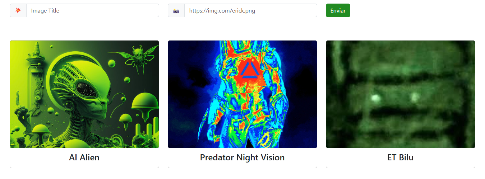

# 📌 Testes End-to-End com Cypress

Este projeto demonstra a implementação de **testes automatizados End-to-End** utilizando **Cypress** em uma aplicação web simples.

O objetivo é aplicar boas práticas de automação de testes como:

- Page Object Model (POM)
- Validação de elementos do DOM
- Testes de cenários positivos e negativos
- Integração contínua (CI/CD) com GitHub Actions

Aplicação utilizada para os testes:

https://erickwendel.github.io/vanilla-js-web-app-example

---

## 🔧 Tecnologias utilizadas

- Cypress
- JavaScript
- GitHub Actions (CI/CD)

---

## 🧪 Cenários automatizados

Os testes automatizados cobrem os seguintes cenários:

### ❌ Cenários negativos
- Envio do formulário com campo **Title vazio**
- Envio com **URL inválida**
- Envio com **campos vazios**

### ✅ Cenários positivos
- Inserção de dados válidos no formulário
- Submissão do formulário utilizando **Enter**
- Validação da criação de um novo **card de imagem**

---

## 📦 Instalação do projeto

Clone o repositório:

```bash
git clone https://github.com/seu-repositorio.git
````


---

## ▶️ Executando os testes

Abrir Cypress no modo interativo:

```bash
npx cypress open
```

Executar testes em modo headless:

```bash
npx cypress run
```

---

# ⚙️ CI/CD

Este projeto utiliza **GitHub Actions** para executar os testes automaticamente a cada:

* push
* pull request

Isso garante que os testes sejam executados continuamente, aumentando a confiabilidade do projeto.

---

# 📂 Estrutura do Projeto

```

web-app-example/
│
├── .github/
│   └── workflows/
│       └── ci.yml               # Pipeline de CI com Cypress
│
├── cypress/
│   ├── e2e/
│   │   ├── registro-form.js      # Page Object com os seletores
│   │   └── web-app-example.cy.js
│   │
│   ├── fixtures/
│   │   └── example.json         
│   │
│   ├── support/
│       ├── commands.js          
│       └── e2e.js  

```

---

## 🖼️ Captura de Tela



---

👨‍💻 Desenvolvido por **Rafael Rufino**

```
